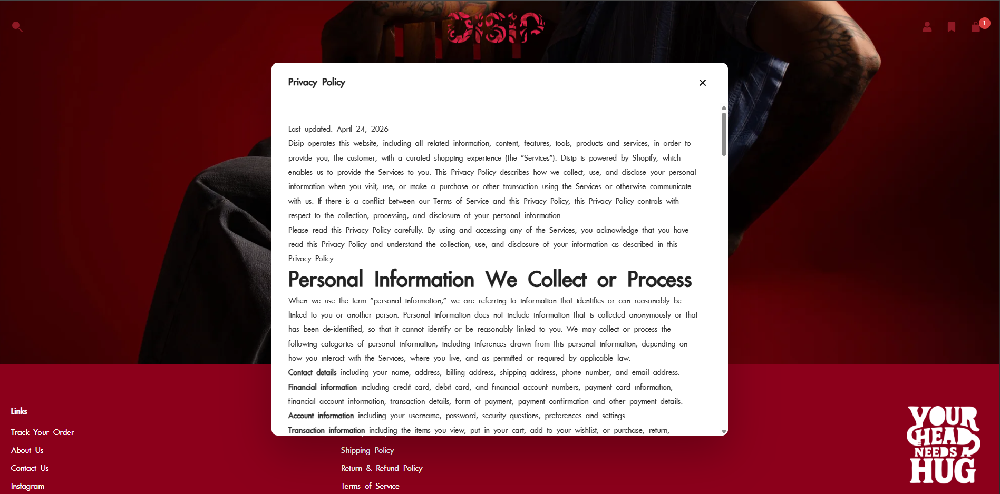

<div align="center">

# DISIP — Custom Shopify Storefront

*Premium streetwear brand. 100% custom theme. Zero boilerplate.*

<table>
  <tr>
    <td>
      
    </td>
    <td>
      
    </td>
  </tr>
  <tr>
    <td>
      
    </td>
  </tr>
</table>
---

## Overview

DISIP came to me with a clear brand identity and zero tolerance for generic. The brief was simple — **build something that feels like the brand, not like Shopify.**

Every pixel of this storefront was written from scratch. No Dawn. No Debut. No paid theme as a base. Just Liquid, CSS, and JavaScript structured the way I wanted it — clean, maintainable, and fast.

---

## The Challenge

Most Shopify projects start with a theme and hack it into shape. That approach leaves you fighting the original developer's decisions at every turn — bloated CSS you can't touch, JS that conflicts with your own, section schemas that don't match the client's needs.

For DISIP, starting from scratch was the only sensible call. The brand's visual language — editorial photography, dark crimson palette, aggressive typography — needed a theme architecture that was purpose-built, not retrofitted.

---

## What I Built

### Theme Architecture

The theme is structured around modularity. Every visual block on the page is a standalone `section` with its own schema, meaning the client can rearrange the homepage from the Shopify editor without touching code. Reusable UI patterns — cards, modals, recommendation strips — live in `snippets/` and are called wherever needed.

```
├── assets/                   # Compiled CSS, vanilla JS, SVGs
├── config/
│   └── settings_schema.json  # Global theme settings (colors, fonts, spacing)
├── layout/
│   └── theme.liquid          # Base HTML shell, meta, font loading
├── locales/                  # i18n strings
├── sections/                 # Every page block — independently schema-driven
├── snippets/                 # Reusable components
│   └── custom-search-box.liquid
└── templates/                # Route-level templates (JSON-based)
```

JSON templates were used throughout, which keeps the template files lean and pushes all logic into sections — the right way to build for Shopify 2.0.

---

### Homepage


Built as a sequence of independent sections rather than one monolithic template. This gives the client full drag-and-drop control over layout order while I retain full control over each component's design.

Notable implementations:
- **Drop #1 collection grid** — custom section pulling from a specific collection handle, two-column layout with hover states on product cards
- **Cap anatomy diagram** — pure HTML/CSS callout layout with positioned labels, no image overlay tricks
- **"DROP #1 — YOUR CROWN AWAITS" typographic banner** — large-scale CSS typography with layered z-index to create the text-behind-image depth effect
- **Brand close-out section** — full viewport editorial image with custom CSS positioning

---

### Product Page


The product page was designed around DISIP's content — long editorial photos that deserve full-width treatment. The layout splits into a scrollable image column on the left and a sticky info panel on the right, built with CSS Grid.

- **Image gallery** — stacked vertical layout instead of the standard carousel, because the photography is meant to be read top-to-bottom, not skipped through
- **Sticky product panel** — `position: sticky` with calculated `top` offset based on header height, so the buy box stays in view as you scroll the images
- **ShopPay / Buy It Now** — integrated via Shopify's native payment button API, styled to match brand colors
- **Collapsible Details / Shipping & Return** — vanilla JS accordion, no library dependency
- **"You Might Also Like"** — recommendation strip built as a snippet, pulling from the product's collection, excluding the current product

---

### Custom Search

A fully custom search component built as a Liquid snippet — `custom-search-box.liquid`. Shopify's default search is functional but visually constrained. This one matches the storefront's aesthetic and is injected wherever the header needs it.

---

### Policy Modal System


Instead of sending users to a separate `/policies/` page, all policy content (Privacy Policy, Shipping Policy, Return & Refund, Terms of Service) loads in an in-page modal. The modal is triggered from footer links, keeping users on the storefront rather than bouncing them to a plain Shopify policy page.

Built with:
- Liquid rendering the policy content server-side inside a hidden container
- Vanilla JS handling open/close/scroll-lock
- CSS handling the overlay, animation, and scrollable content area

No jQuery. No modal library. ~40 lines of JS.

---

### Footer

Two-column link structure with the DISIP brand stamp. Fully schema-driven — the client can update link labels and URLs from the Shopify customizer.

---

## Technical Decisions Worth Noting

**Why vanilla JS throughout?**
DISIP's store doesn't need a framework. Every interactive element — the modal, the accordion, the search — is simple enough that pulling in Alpine.js or Vue would add weight without adding capability. Vanilla JS keeps the bundle lean and loads fast.

**Why no utility CSS framework?**
Tailwind and similar tools work well on projects where design consistency is enforced by a system. On a brand-first project like this, the design *is* the system. Writing custom CSS gave me precise control over every spacing value, animation curve, and breakpoint without fighting a framework's opinions.

**Why JSON templates over `.liquid` templates?**
Shopify 2.0's JSON template format lets sections be added, removed, and reordered per-page without code changes. It's the right architecture for any Shopify build in 2024+. Using `.liquid` templates the old way would have locked the client into a static layout.

---

## Stack

| Layer | Choice | Reason |
|---|---|---|
| Platform | Shopify | Client requirement |
| Templating | Liquid | Shopify native |
| Styling | Custom CSS | Full design control |
| Scripting | Vanilla JS | No unnecessary overhead |
| Template format | JSON (OS 2.0) | Editor-flexible, maintainable |
| Checkout | ShopPay + Razorpay | Client's payment setup |

---

## Drop #1 — Live Products

| Product | Price |
|---|---|
| Shaasak | Rs. 3,800 |
| Bakhtiyaar | Rs. 3,500 |
| Vasyu | Rs. 3,500 |
| Khoobhsoor | Rs. 3,500 |

---

<div align="center">

*Built for DISIP · © 2026*

</div>
